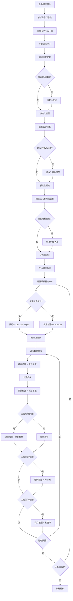

# MokioMind 预训练脚本详解

## 📋 目录
- [1. 整体概述](#1-整体概述)
- [2. 代码详细讲解](#2-代码详细讲解)
  - [2.1 导入模块与环境配置](#21-导入模块与环境配置)
  - [2.2 命令行参数定义](#22-命令行参数定义)
  - [2.3 核心训练函数 train_epoch](#23-核心训练函数-train_epoch)
  - [2.4 主程序流程](#24-主程序流程)
- [3. 关键技术点逐行解析](#3-关键技术点逐行解析)
- [4. 训练流程图](#4-训练流程图)
- [5. 最佳实践与注意事项](#5-最佳实践与注意事项)

---

## 1. 整体概述

### 1.1 文件作用
`train_pretrain.py` 是 MokioMind 项目的**预训练核心脚本**，负责从零开始或基于已有权重对语言模型进行大规模预训练。

### 1.2 核心目标
- **自回归语言建模**：通过 Next-Token Prediction（下一个词预测）任务训练模型
- **分布式训练支持**：支持多 GPU 并行训练，提升训练效率
- **混合精度训练**：使用 bfloat16/float16 减少显存占用，加速训练
- **断点续训**：支持从检查点恢复训练状态，避免意外中断导致进度丢失
- **实验跟踪**：集成 WandB/SwanLab，可视化记录训练过程

### 1.3 技术栈
- **深度学习框架**：PyTorch
- **分布式训练**：torch.distributed + DistributedDataParallel (DDP)
- **优化器**：AdamW
- **数据加载**：自定义 PretrainDataset + DataLoader
- **实验管理**：SwanLab（替代 WandB）

---

## 2. 代码详细讲解

### 2.1 导入模块与环境配置

```python
import os
import sys

__package__ = "trainer"
sys.path.append(os.path.abspath(os.path.join(os.path.dirname(__file__), "..")))
```

**功能说明**：
- 设置包名为 `trainer`，确保相对导入正常工作
- 将项目根目录添加到 Python 路径，使得可以从任意位置运行脚本时正确导入模块

**关键依赖导入**：
```python
import argparse          # 命令行参数解析
import time              # 时间统计（计算训练速度、ETA）
import warnings          # 警告控制（忽略无关警告）
import torch
import torch.distributed as dist  # 分布式训练支持
from contextlib import nullcontext  # 空上下文管理器（CPU 不支持 autocast 时使用）
from torch import optim             # 优化器
from torch.nn.parallel import DistributedDataParallel  # DDP 封装
from torch.utils.data import DataLoader, DistributedSampler  # 数据加载器

from model.MokioModel import MokioMindConfig  # 模型配置类
from dataset.lm_dataset import PretrainDataset  # 预训练数据集
from trainer.trainer_utils import (...)  # 工具函数集合
```

**设计亮点**：
- 使用 `warnings.filterwarnings("ignore")` 保持输出清洁，避免第三方库的警告干扰训练日志
- 分离关注点：模型配置、数据集、训练工具分别独立导入，便于维护和测试

---

### 2.2 命令行参数定义

#### 基础训练参数
```python
parser.add_argument("--save_dir", type=str, default="../out", 
                    help="模型保存目录")
parser.add_argument("--save_weight", default="pretrain", type=str, 
                    help="保存权重的前缀名")
parser.add_argument("--epochs", type=int, default=1, 
                    help="训练轮数（建议1轮zero或2-6轮充分训练）")
parser.add_argument("--batch_size", type=int, default=32, 
                    help="batch size")
parser.add_argument("--learning_rate", type=float, default=5e-4, 
                    help="初始学习率")
```

**参数说明**：
| 参数 | 默认值 | 说明 |
|------|--------|------|
| `--save_dir` | `../out` | 模型权重保存路径 |
| `--save_weight` | `pretrain` | 权重文件名前缀 |
| `--epochs` | `1` | 完整遍历数据集的次数 |
| `--batch_size` | `32` | 每个 GPU 的批次大小 |
| `--learning_rate` | `5e-4` | AdamW 优化器初始学习率 |

#### 硬件和性能参数
```python
parser.add_argument("--device", type=str, 
                    default="cuda:0" if torch.cuda.is_available() else "cpu",
                    help="训练设备")
parser.add_argument("--dtype", type=str, default="bfloat16", 
                    help="混合精度类型")
parser.add_argument("--num_workers", type=int, default=1, 
                    help="数据加载线程数")
```

**混合精度选择**：
- **bfloat16**：Google 开发，数值范围与 float32 相同，更稳定，适合大模型训练
- **float16**：标准半精度，节省 50% 显存，但可能出现溢出问题

#### 训练策略参数
```python
parser.add_argument("--accumulation_steps", type=int, default=8, 
                    help="梯度累积步数")
parser.add_argument("--grad_clip", type=float, default=1.0, 
                    help="梯度裁剪阈值")
parser.add_argument("--log_interval", type=int, default=100, 
                    help="日志打印间隔")
parser.add_argument("--save_interval", type=int, default=100, 
                    help="模型保存间隔")
```

**梯度累积原理**：
```
有效 batch_size = batch_size × accumulation_steps × num_gpus
示例：32 × 8 × 1 = 256（等效于单次 batch_size=256 的训练）
```

**优势**：
- 在显存有限的情况下模拟大批次训练
- 减少通信开销（每 accumulation_steps 步才同步一次梯度）

#### 模型架构参数
```python
parser.add_argument("--hidden_size", default=512, type=int, 
                    help="隐藏层维度")
parser.add_argument("--num_hidden_layers", default=8, type=int, 
                    help="隐藏层数量")
parser.add_argument("--max_seq_len", default=512, type=int, 
                    help="训练的最大截断长度")
parser.add_argument("--use_moe", default=0, type=int, 
                    choices=[0, 1], 
                    help="是否使用MoE架构（0=否，1=是）")
```

**MoE（Mixture of Experts）**：
- 稀疏激活机制，每次只激活部分专家网络
- 在相同参数量下提供更高的计算效率
- 适合大规模模型的扩展

#### 数据和恢复参数
```python
parser.add_argument("--data_path", type=str, 
                    default="../dataset/pretrain_hq.jsonl",
                    help="预训练数据路径")
parser.add_argument("--from_weight", default="none", type=str, 
                    help="基于哪个权重训练，为none则从头开始")
parser.add_argument("--from_resume", default=0, type=int, 
                    choices=[0, 1],
                    help="是否自动检测&续训（0=否，1=是）")
```

**断点续训逻辑**：
- `from_weight`：加载预训练权重作为初始化
- `from_resume`：完全恢复训练状态（包括优化器动量、学习率调度等）

---

### 2.3 核心训练函数 train_epoch

#### 函数签名
```python
def train_epoch(epoch, loader, iters, start_step=0, wandb=None):
```

**参数说明**：
- `epoch`：当前训练轮次（从 0 开始）
- `loader`：DataLoader 实例，提供训练数据批次
- `iters`：总迭代次数（用于计算学习率和 ETA）
- `start_step`：起始步骤（断点续训时跳过已训练的步数）
- `wandb`：实验跟踪对象（可选）

#### 训练循环主体
```python
for step, (input_ids, labels, attention_mask) in enumerate(
    loader, start=start_step + 1
):
```

**数据解包**：
- `input_ids`：输入 token IDs，形状 `[batch_size, seq_len]`
- `labels`：标签 token IDs（通常与 input_ids 错位一格）
- `attention_mask`：注意力掩码，标识有效 token 位置

#### 设备转移与学习率调度
```python
input_ids = input_ids.to(args.device)
labels = labels.to(args.device)
attention_mask = attention_mask.to(args.device)

lr = get_lr(epoch * iters + step, args.epochs * iters, args.learning_rate)

for param_group in optimizer.param_groups:
    param_group["lr"] = lr
```

**学习率调度策略**：
- 使用余弦退火或其他衰减策略（具体实现在 `get_lr` 函数中）
- 动态调整学习率有助于模型收敛到更好的局部最优解

#### 混合精度前向传播
```python
with autocast_ctx:
    res = model(input_ids, labels=labels, attention_mask=attention_mask)
    loss = (res.loss + res.aux_loss) / args.accumulation_steps
```

**关键点**：
- `autocast_ctx`：根据设备类型自动选择是否启用混合精度
  - GPU：`torch.cuda.amp.autocast(dtype=dtype)`
  - CPU：`nullcontext()`（空操作）
- `res.loss`：主要损失（交叉熵）
- `res.aux_loss`：辅助损失（如 MoE 的负载均衡损失）
- 除以 `accumulation_steps`：实现梯度累积

#### 反向传播与梯度更新
```python
scaler.scale(loss).backward()

if step % args.accumulation_steps == 0:
    scaler.unscale_(optimizer)
    torch.nn.utils.clip_grad_norm_(model.parameters(), args.grad_clip)
    scaler.step(optimizer)
    scaler.update()
    optimizer.zero_grad(set_to_none=True)
```

**梯度缩放器工作流程**：
1. **`scaler.scale(loss).backward()`**：放大损失值后反向传播，防止小梯度下溢
2. **`scaler.unscale_(optimizer)`**：还原梯度的真实值
3. **`clip_grad_norm_`**：梯度裁剪，防止梯度爆炸
4. **`scaler.step(optimizer)`**：执行参数更新
5. **`scaler.update()`**：根据梯度情况调整缩放因子
6. **`optimizer.zero_grad(set_to_none=True)`**：清空梯度（`set_to_none=True` 比赋零更高效）

**为什么需要梯度裁剪？**
- 深层网络容易出现梯度爆炸
- 限制梯度范数在 `grad_clip`（默认 1.0）以内
- 提高训练稳定性

#### 日志记录
```python
if step % args.log_interval == 0 or step == iters:
    spend_time = time.time() - start_time
    current_loss = loss.item() * args.accumulation_steps
    current_lr = optimizer.param_groups[-1]["lr"]
    eta_min = spend_time / (step + 1) * iters // 60 - spend_time // 60
    
    Logger(f"Epoch:[{epoch + 1}/{args.epochs}]({step}/{iters}) "
           f"loss:{current_loss:.6f} lr:{current_lr:.12f} "
           f"epoch_Time:{eta_min}min:")
    
    if wandb:
        wandb.log({"loss": current_loss, "lr": current_lr, 
                   "epoch_Time": eta_min})
```

**日志内容**：
- `loss`：当前批次的平均损失（乘以累积步数恢复真实值）
- `lr`：当前学习率（保留 12 位小数以观察微小变化）
- `eta_min`：预计剩余训练时间（分钟）

**ETA 计算公式**：
```
平均每步耗时 = spend_time / (step + 1)
剩余步数 = iters - step
剩余时间 = 平均每步耗时 × 剩余步数
```

#### 模型保存
```python
if (step % args.save_interval == 0 or step == iters) and is_main_process():
    model.eval()
    
    moe_suffix = "_moe" if hasattr(lm_config, "use_moe") and lm_config.use_moe else ""
    ckp = f"{args.save_dir}/{args.save_weight}_{lm_config.hidden_size}{moe_suffix}.pth"
    
    if isinstance(model, torch.nn.parallel.DistributedDataParallel):
        state_dict = model.module.state_dict()
    else:
        state_dict = model.state_dict()
    
    state_dict = {k: v.half() for k, v in state_dict.items()}
    torch.save(state_dict, ckp)
    
    lm_checkpoint(lm_config, weight=args.save_weight, model=model,
                  optimizer=optimizer, scaler=scaler, epoch=epoch,
                  step=step, wandb=wandb, save_dir="../checkpoints")
    
    model.train()
```

**保存策略**：
1. **切换到评估模式**：`model.eval()` 禁用 Dropout 等训练专用层
2. **处理 DDP 包装**：分布式训练时需通过 `.module` 访问原始模型
3. **半精度转换**：`.half()` 将 float32 转为 float16，减少 50% 存储空间
4. **保存完整检查点**：包含模型、优化器、缩放器、训练进度等状态
5. **恢复训练模式**：`model.train()` 重新启用 Dropout

**为什么只保存主进程的模型？**
- 分布式训练中所有 GPU 的模型参数保持一致
- 避免重复保存，节省 I/O 开销

---

### 2.4 主程序流程

#### 第一步：初始化环境和随机种子
```python
local_rank = init_distributed_mode()
if dist.is_initialized():
    args.device = f"cuda:{local_rank}"

setup_seed(42 + (dist.get_rank() if dist.is_initialized() else 0))
```

**分布式初始化**：
- `init_distributed_mode()`：设置进程组、分配 GPU
- `local_rank`：当前进程在本机上的 GPU 编号（0, 1, 2, ...）

**随机种子设置**：
- 基础种子：42（常用随机种子）
- 分布式训练：每个进程加上自己的 rank，保证不同进程有不同的随机序列
- 目的：既保证可复现性，又避免数据采样完全相同

#### 第二步：配置目录、模型参数、检查点
```python
os.makedirs(args.save_dir, exist_ok=True)

lm_config = MokioMindConfig(
    hidden_size=args.hidden_size,
    num_hidden_layers=args.num_hidden_layers,
    use_moe=bool(args.use_moe),
)

ckp_data = (lm_checkpoint(lm_config, weight=args.save_weight, 
                          save_dir="../checkpoints")
            if args.from_resume == 1 else None)
```

**模型配置**：
- 创建 `MokioMindConfig` 对象，传递超参数
- 其他参数使用默认值（如 `num_attention_heads=8`, `vocab_size=6400`）

**断点续训检测**：
- 如果 `from_resume=1`，尝试加载之前的训练状态
- `ckp_data` 包含：模型参数、优化器状态、缩放器状态、epoch、step、wandb_id

#### 第三步：设置混合精度
```python
device_type = "cuda" if "cuda" in args.device else "cpu"
dtype = torch.bfloat16 if args.dtype == "bfloat16" else torch.float16

autocast_ctx = (nullcontext() if device_type == "cpu" 
                else torch.cuda.amp.autocast(dtype=dtype))
```

**上下文管理器选择**：
- GPU：使用 `torch.cuda.amp.autocast` 自动混合精度
- CPU：使用 `nullcontext()` 空操作（CPU 不支持 autocast）

#### 第四步：配置 WandB 实验跟踪
```python
wandb = None
if args.use_wandb and is_main_process():
    import swanlab as wandb
    
    wandb_id = ckp_data.get("wandb_id") if ckp_data else None
    resume = "must" if wandb_id else None
    
    wandb_run_name = (f"MokioMind-Pretrain-Epoch-{args.epochs}-"
                      f"BatchSize-{args.batch_size}-"
                      f"LearningRate-{args.learning_rate}")
    wandb.init(project=args.wandb_project, name=wandb_run_name, 
               id=wandb_id, resume=resume)
```

**实验恢复机制**：
- 如果有检查点数据，提取 `wandb_id` 恢复到同一个实验
- `resume="must"`：强制恢复到指定实验，避免创建新实验

**实验命名规范**：
- 包含关键超参数：epochs、batch_size、learning_rate
- 便于在 WandB 界面快速识别不同配置的实验

#### 第五步：定义模型、数据、优化器
```python
model, tokenizer = init_model(lm_config, args.from_weight, device=args.device)

train_ds = PretrainDataset(args.data_path, tokenizer, max_length=args.max_seq_len)

train_sampler = DistributedSampler(train_ds) if dist.is_initialized() else None

scaler = torch.cuda.amp.GradScaler(enabled=(args.dtype == "float16"))

optimizer = optim.AdamW(model.parameters(), lr=args.learning_rate)
```

**组件初始化顺序**：
1. **模型**：根据配置创建 MokioMind 模型，可选加载预训练权重
2. **数据集**：惰性加载 JSONL 文件，避免一次性读入内存
3. **采样器**：分布式训练时使用 `DistributedSampler` 分配数据
4. **缩放器**：仅在 float16 模式下启用（bfloat16 不需要缩放）
5. **优化器**：AdamW 优化器，结合权重衰减的正则化

**为什么 bfloat16 不需要 GradScaler？**
- bfloat16 的数值范围与 float32 相同，不会发生梯度下溢
- float16 的数值范围较小，需要缩放梯度以防止下溢

#### 第六步：恢复训练状态（断点续训）
```python
start_epoch, start_step = 0, 0
if ckp_data:
    model.load_state_dict(ckp_data["model"])
    optimizer.load_state_dict(ckp_data["optimizer"])
    scaler.load_state_dict(ckp_data["scaler"])
    start_epoch = ckp_data["epoch"]
    start_step = ckp_data.get("step", 0)
```

**恢复内容**：
- **模型参数**：权重矩阵、偏置项等
- **优化器状态**：一阶矩估计（momentum）、二阶矩估计（variance）
- **缩放器状态**：当前的缩放因子、增长/回退计数器
- **训练进度**：epoch 和 step，用于继续训练

#### 第七步：分布式数据并行封装
```python
if dist.is_initialized():
    model._ddp_params_and_buffers_to_ignore = {"freqs_cos", "freqs_sin"}
    model = DistributedDataParallel(model, device_ids=[local_rank])
```

**RoPE 位置编码特殊处理**：
- `freqs_cos` 和 `freqs_sin` 是 RoPE（Rotary Position Embedding）的缓存
- 这些是确定性计算的常量，不需要梯度同步
- 忽略它们可以减少通信开销

**DDP 工作原理**：
- 每个 GPU 持有模型的完整副本
- 前向传播：各 GPU 独立计算
- 反向传播：自动同步梯度（AllReduce）
- 参数更新：各 GPU 独立更新（由于梯度一致，参数保持一致）

#### 第八步：训练循环
```python
for epoch in range(start_epoch, args.epochs):
    if train_sampler:
        train_sampler.set_epoch(epoch)
    
    if epoch == start_epoch and start_step > 0:
        # 断点续训：跳过已训练的批次
        batch_sampler = SkipBatchSampler(train_sampler or range(len(train_ds)), 
                                         args.batch_size, start_step)
        loader = DataLoader(train_ds, batch_sampler=batch_sampler, 
                            num_workers=args.num_workers, pin_memory=True)
        Logger(f"Epoch [{epoch + 1}/{args.epochs}]: 跳过前{start_step}个step，"
               f"从step {start_step + 1}开始")
        train_epoch(epoch, loader, len(loader) + start_step, start_step, wandb)
    else:
        # 正常训练
        loader = DataLoader(train_ds, batch_size=args.batch_size, 
                            shuffle=(train_sampler is None),
                            sampler=train_sampler,
                            num_workers=args.num_workers, pin_memory=True)
        train_epoch(epoch, loader, len(loader), 0, wandb)
```

**分布式采样器的 epoch 设置**：
- `set_epoch(epoch)`：每个 epoch 使用不同的随机种子打乱数据
- 确保不同 epoch 的数据顺序不同，提升模型泛化能力

**断点续训的特殊处理**：
- 使用 `SkipBatchSampler` 跳过已训练的批次
- 避免重复训练相同的数据
- `len(loader) + start_step`：修正总迭代次数，确保学习率调度正确

**DataLoader 参数**：
- `shuffle`：非分布式训练时随机打乱数据
- `pin_memory=True`：锁页内存，加速 CPU 到 GPU 的数据传输
- `num_workers`：多进程数据加载，提升数据预处理速度

---

## 3. 关键技术点逐行解析

### 3.1 梯度累积的实现原理

```python
loss = loss / args.accumulation_steps  # 第 67 行
scaler.scale(loss).backward()          # 第 72 行

if step % args.accumulation_steps == 0:  # 第 74 行
    scaler.step(optimizer)               # 第 79 行
    optimizer.zero_grad(set_to_none=True)  # 第 81 行
```

**工作流程**：
1. **缩小损失**：将损失除以累积步数，确保梯度幅度正确
2. **累加梯度**：多次反向传播的梯度会累加在 `.grad` 属性中
3. **定期更新**：每 `accumulation_steps` 步执行一次参数更新
4. **清空梯度**：更新后立即清空，准备下一轮累积

**数学推导**：
```
假设 accumulation_steps = 4

第1步：loss1/4 → grad1/4
第2步：loss2/4 → grad2/4 （累加：grad1/4 + grad2/4）
第3步：loss3/4 → grad3/4 （累加：grad1/4 + grad2/4 + grad3/4）
第4步：loss4/4 → grad4/4 （累加：grad1/4 + ... + grad4/4）
       更新参数：θ = θ - lr × (grad1 + grad2 + grad3 + grad4) / 4
       等价于：θ = θ - lr × mean(grad1, grad2, grad3, grad4)
```

### 3.2 混合精度训练的安全性

```python
scaler = torch.cuda.amp.GradScaler(enabled=(args.dtype == "float16"))  # 第 289 行
scaler.scale(loss).backward()                                          # 第 72 行
scaler.unscale_(optimizer)                                             # 第 76 行
scaler.step(optimizer)                                                 # 第 79 行
scaler.update()                                                        # 第 80 行
```

**GradScaler 的工作机制**：
1. **放大损失**：`scale(loss)` 将损失乘以缩放因子（如 2^10），防止梯度下溢
2. **反向传播**：放大的梯度仍在 float16 范围内
3. **还原梯度**：`unscale_` 将梯度除以缩放因子，恢复真实值
4. **检查溢出**：如果梯度出现 Inf/NaN，跳过本次更新并减小缩放因子
5. **动态调整**：根据梯度情况自动调整缩放因子

**为什么 bfloat16 不需要缩放？**
```
float16 范围：6.0×10⁻⁸ ~ 6.5×10⁴  （容易下溢）
bfloat16 范围：1.2×10⁻³⁸ ~ 3.4×10³⁸ （与 float32 相同）
```

### 3.3 分布式训练的数据分配

```python
train_sampler = DistributedSampler(train_ds) if dist.is_initialized() else None  # 第 285 行

if train_sampler:
    train_sampler.set_epoch(epoch)  # 第 324 行
```

**DistributedSampler 原理**：
```
假设有 4 个 GPU，1000 条数据：

GPU 0：索引 0, 4, 8, 12, ...   （rank 0 的数据）
GPU 1：索引 1, 5, 9, 13, ...   （rank 1 的数据）
GPU 2：索引 2, 6, 10, 14, ...  （rank 2 的数据）
GPU 3：索引 3, 7, 11, 15, ...  （rank 3 的数据）
```

**set_epoch 的作用**：
- 每个 epoch 使用不同的随机种子打乱数据
- 确保同一批次在不同 epoch 看到不同的数据子集
- 提升模型的泛化能力

### 3.4 学习率调度的实现

```python
lr = get_lr(epoch * iters + step, args.epochs * iters, args.learning_rate)  # 第 54 行
```

**典型的学习率调度策略**（余弦退火）：
```python
def get_lr(current_step, total_steps, base_lr):
    """余弦退火学习率调度"""
    return base_lr * 0.5 * (1 + math.cos(math.pi * current_step / total_steps))
```

**学习率变化曲线**：
```
lr
↑
|     *
|    * *
|   *   *
|  *     *
| *       *
|*         *
+----------------→ step
0          total_steps
```

**优势**：
- 初期快速下降，逃离局部最优
- 后期缓慢收敛，找到更优解
- 平滑过渡，避免震荡

### 3.5 断点续训的完整性

```python
lm_checkpoint(
    lm_config,
    weight=args.save_weight,
    model=model,
    optimizer=optimizer,
    scaler=scaler,
    epoch=epoch,
    step=step,
    wandb=wandb,
    save_dir="../checkpoints",
)
```

**检查点包含的内容**：
1. **模型配置**：`lm_config`（超参数）
2. **模型参数**：`model.state_dict()`
3. **优化器状态**：`optimizer.state_dict()`（动量、方差估计）
4. **缩放器状态**：`scaler.state_dict()`（缩放因子、历史统计）
5. **训练进度**：`epoch`, `step`
6. **实验 ID**：`wandb.run.id`（用于恢复实验）

**恢复时的验证**：
```python
if ckp_data:
    model.load_state_dict(ckp_data["model"])
    optimizer.load_state_dict(ckp_data["optimizer"])
    scaler.load_state_dict(ckp_data["scaler"])
    start_epoch = ckp_data["epoch"]
    start_step = ckp_data.get("step", 0)
```

**为什么需要保存优化器状态？**
- AdamW 优化器维护每个参数的一阶矩和二阶矩估计
- 如果不恢复，优化器会从零开始估计，导致训练不稳定
- 恢复后可以无缝继续训练，保持优化轨迹

---

## 4. 训练流程图



---

## 5. 最佳实践与注意事项

### 5.1 超参数调优建议

#### Batch Size 选择
```
显存充足：batch_size = 64-128
显存有限：batch_size = 16-32，配合 accumulation_steps
有效 batch_size = batch_size × accumulation_steps × num_gpus
推荐有效 batch_size：256-1024
```

#### 学习率选择
```
小模型（<100M 参数）：1e-3 ~ 5e-4
中等模型（100M-1B 参数）：5e-4 ~ 1e-4
大模型（>1B 参数）：1e-4 ~ 5e-5
```

**学习率与 batch size 的关系**：
```
lr ∝ sqrt(batch_size)
如果 batch_size 翻倍，学习率应增加约 1.4 倍
```

#### 训练轮数
```
Zero-shot 场景：1 epoch（避免过拟合）
充分训练：2-6 epochs
监控验证集损失，early stopping
```

### 5.2 分布式训练注意事项

#### 启动命令
```bash
# 单机多卡训练
torchrun --nproc_per_node=4 trainer/train_pretrain.py \
    --batch_size 32 \
    --accumulation_steps 8 \
    --epochs 2

# 多机多卡训练
torchrun --nnodes=2 --nproc_per_node=4 \
    --master_addr=192.168.1.1 --master_port=29500 \
    trainer/train_pretrain.py
```

#### 常见问题
1. **显存不均衡**：不同 GPU 的显存占用可能略有差异，属正常现象
2. **通信瓶颈**：增加 `accumulation_steps` 可减少通信频率
3. **数据加载慢**：增加 `num_workers`，使用 SSD 存储数据

### 5.3 混合精度训练陷阱

#### bfloat16 vs float16
```python
# ✅ 推荐：bfloat16（更稳定）
--dtype bfloat16

# ⚠️ 谨慎：float16（需启用 GradScaler）
--dtype float16
```

#### 数值稳定性检查
```python
# 在训练循环中添加检查
if torch.isnan(loss) or torch.isinf(loss):
    print("检测到 NaN/Inf 损失！")
    break
```

### 5.4 断点续训最佳实践

#### 定期保存
```python
# 建议每 100-500 步保存一次
--save_interval 100
```

#### 检查点管理
```
checkpoints/
├── pretrain_512_epoch_0_step_100.pth  # 完整检查点
├── pretrain_512_epoch_0_step_200.pth
└── ...

out/
├── pretrain_512.pth  # 最新模型权重（半精度）
└── ...
```

**清理旧检查点**：
```python
# 定期删除旧的检查点，节省磁盘空间
import glob
ckps = sorted(glob.glob("../checkpoints/*.pth"))
if len(ckps) > 10:
    for old_ckp in ckps[:-10]:
        os.remove(old_ckp)
```

### 5.5 性能优化技巧

#### 数据加载优化
```python
# ✅ 使用 pin_memory 加速 CPU→GPU 传输
DataLoader(..., pin_memory=True)

# ✅ 增加 worker 数量（根据 CPU 核心数调整）
--num_workers 4

# ✅ 使用 SSD 存储数据
--data_path /ssd/dataset/pretrain.jsonl
```

#### 模型训练优化
```python
# ✅ 启用 Flash Attention（如果模型支持）
lm_config.flash_attention = True

# ✅ 梯度检查点（牺牲速度换显存）
model.gradient_checkpointing_enable()

# ✅ 编译模型（PyTorch 2.0+）
model = torch.compile(model)
```

### 5.6 调试技巧

#### 小规模测试
```bash
# 先用小数据集测试流程
--data_path ../dataset/test_small.jsonl \
--batch_size 2 \
--epochs 1 \
--save_interval 10
```

#### 监控显存
```python
# 在训练循环中添加
if step % 10 == 0:
    print(f"GPU 显存: {torch.cuda.memory_allocated() / 1e9:.2f} GB")
```

#### 梯度检查
```python
# 检查梯度是否正常
for name, param in model.named_parameters():
    if param.grad is not None:
        print(f"{name}: grad_norm={param.grad.norm().item():.6f}")
```

---

## 附录：常见错误与解决方案

### 错误 1：CUDA Out of Memory
```
RuntimeError: CUDA out of memory. Tried to allocate 2.00 GiB
```

**解决方案**：
1. 减小 `batch_size`
2. 增加 `accumulation_steps`
3. 启用梯度检查点
4. 使用更小的模型（减小 `hidden_size` 或 `num_hidden_layers`）

### 错误 2：分布式训练死锁
```
程序卡在某个地方不动
```

**解决方案**：
1. 确保所有进程都调用 `dist.init_process_group()`
2. 检查是否有进程提前退出
3. 使用 `torchrun` 而非手动启动多进程

### 错误 3：NaN 损失
```
loss: nan
```

**解决方案**：
1. 降低学习率
2. 增加梯度裁剪阈值（`--grad_clip 5.0`）
3. 检查数据是否有异常值
4. 切换为 bfloat16

### 错误 4：数据加载慢
```
训练速度慢，GPU 利用率低
```

**解决方案**：
1. 增加 `num_workers`
2. 使用 `pin_memory=True`
3. 将数据转换为二进制格式（如 Arrow、TFRecord）
4. 预分词并缓存

---

## 总结

`train_pretrain.py` 是一个功能完善的预训练脚本，具备以下特点：

✅ **模块化设计**：模型、数据、训练逻辑分离  
✅ **分布式支持**：原生支持多 GPU 并行训练  
✅ **混合精度**：bfloat16/float16 灵活选择  
✅ **断点续训**：完整保存和恢复训练状态  
✅ **实验跟踪**：集成 WandB/SwanLab  
✅ **生产就绪**：包含梯度裁剪、日志记录、模型保存等最佳实践  

通过深入理解这个脚本，你可以：
- 掌握大规模语言模型的训练流程
- 学习分布式训练的核心技术
- 了解混合精度训练的原理
- 构建自己的训练框架

祝你训练顺利！🚀
